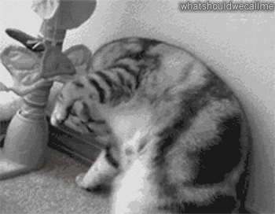

# RearAware
Because your cat has no sense of professional boundaries.

RearAware is a real time AI webcam filter that detects and censors cat butts during video calls. Powered by a custom trained YOLO model, it identifies feline rear ends in real time and automatically covers them with a CENSORED sticker.

Built for Google Meet, Zoom, and Microsoft Teams.



## What you'll need
- A Mac
- Python 3
- OBS Studio (Download from obsproject.com and install it. No need to run it.)
- A cat with no shame

## Installation
Download or clone this repo, then open Terminal and run:

```bash
pip3 install ultralytics
pip3 install opencv-contrib-python
pip3 install pyvirtualcam
```

## How to run
Double-click `RearAware.command` on your Desktop.

Or in Terminal:
```bash
cd ~/Desktop/RearAware
python3 rearaware.py
```

## Using it in a meeting
1. Start RearAware first
2. Open Google Meet, Zoom, or Teams
3. Go to camera settings and select **OBS Virtual Camera**
4. That's it :) your cat's dignity is now protected

Press `Ctrl+C` in Terminal to stop.

## Notes
- Works best with good lighting
- The model was trained on cats only, not dogs, humans, or anything else
- Sound effects are random. You're welcome.


